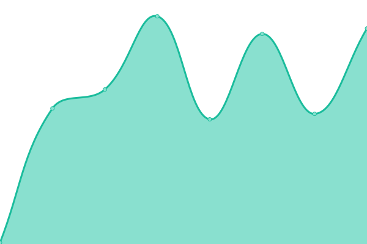

# 🚥 statut.api.gouv.fr

Bienvenue sur le tableau de bord des disponibilités des API du service public français

## 🏗 Comment ca marche ?

Ce projet est un fork du projet opensource upptime (https://upptime.js.org). Il fonctionne entièrement avec des GitHub Actions et des Issues. Il est développé par l'excellente équipe de [Koj](https://koj.co).

## 🦦 Ou on en est ?

<!--start: status pages-->
<!-- This summary is generated by Upptime (https://github.com/upptime/upptime) -->
<!-- Do not edit this manually, your changes will be overwritten -->
<!-- prettier-ignore -->
| URL | Status | History | Response Time | Uptime |
| --- | ------ | ------- | ------------- | ------ |
|  [API Particulier](https://particulier.api.gouv.fr/api/ping) | Opérationnel | [api-particulier.yml](https://github.com/betagouv/statut.api.gouv.fr/commits/HEAD/history/api-particulier.yml) | 

 641ms
     
 | 

<a href="https://statut.api.gouv.fr/history/api-particulier">99.35%</a>
    

|  [API Adresse (Base Adresse Nationale)](https://api-adresse.data.gouv.fr/search/?q=8+bd+du+port) | Opérationnel | [api-adresse-base-adresse-nationale.yml](https://github.com/betagouv/statut.api.gouv.fr/commits/HEAD/history/api-adresse-base-adresse-nationale.yml) | 

 1183ms
     
 | 

<a href="https://statut.api.gouv.fr/history/api-adresse-base-adresse-nationale">99.92%</a>
    

|  [API Découpage Administratif - (API Geo)](https://geo.api.gouv.fr/regions/01?fields=nom,code) | Opérationnel | [api-decoupage-administratif-api-geo.yml](https://github.com/betagouv/statut.api.gouv.fr/commits/HEAD/history/api-decoupage-administratif-api-geo.yml) | 

 860ms
     
 | 

<a href="https://statut.api.gouv.fr/history/api-decoupage-administratif-api-geo">99.36%</a>
    

|  [API Aide financieres de l’ADEME](https://koumoul.com/s/data-fair/api/v1/datasets/les-aides-financieres-de-l%27ademe/data-files) | Opérationnel | [api-aide-financieres-de-l-ademe.yml](https://github.com/betagouv/statut.api.gouv.fr/commits/HEAD/history/api-aide-financieres-de-l-ademe.yml) | 

 620ms
     
 | 

<a href="https://statut.api.gouv.fr/history/api-aide-financieres-de-l-ademe">99.36%</a>
    

|  [API Aides financières à la rénovation énergetique (Simul’Aid€s)](https://koumoul.com/s/data-fair/api/v1/datasets/simul%27aideuros-dispositifs/data-files) | Opérationnel | [api-aides-financieres-a-la-renovation-energetique-simul-aid-s.yml](https://github.com/betagouv/statut.api.gouv.fr/commits/HEAD/history/api-aides-financieres-a-la-renovation-energetique-simul-aid-s.yml) | 

 230ms
     
 | 

<a href="https://statut.api.gouv.fr/history/api-aides-financieres-a-la-renovation-energetique-simul-aid-s">100.00%</a>
    

|  [API Base Carbone](https://koumoul.com/s/data-fair/api/v1/datasets/base-carbone(r)/data-files) | Opérationnel | [api-base-carbone.yml](https://github.com/betagouv/statut.api.gouv.fr/commits/HEAD/history/api-base-carbone.yml) | 

 231ms
     
 | 

<a href="https://statut.api.gouv.fr/history/api-base-carbone">99.37%</a>
    

|  [API BOAMP](https://api.dila.fr/opendata/api-boamp/annonces/search?criterion=test) | Indisponible | [api-boamp.yml](https://github.com/betagouv/statut.api.gouv.fr/commits/HEAD/history/api-boamp.yml) | 

 0ms
     
 | 

<a href="https://statut.api.gouv.fr/history/api-boamp">0.00%</a>
    

|  [API Camino](https://api.camino.beta.gouv.fr/titres) | Opérationnel | [api-camino.yml](https://github.com/betagouv/statut.api.gouv.fr/commits/HEAD/history/api-camino.yml) | 

 18705ms
     
 | 

<a href="https://statut.api.gouv.fr/history/api-camino">99.37%</a>
    

|  [API Répertoire National des Associations](https://entreprise.data.gouv.fr/api/rna/v1/id/W9C1000188) | Opérationnel | [api-repertoire-national-des-associations.yml](https://github.com/betagouv/statut.api.gouv.fr/commits/HEAD/history/api-repertoire-national-des-associations.yml) | 

 428ms
     
 | 

<a href="https://statut.api.gouv.fr/history/api-repertoire-national-des-associations">99.75%</a>
    

|  [API Sirene données ouvertes](https://entreprise.data.gouv.fr/api/sirene/v3/etablissements/?etat_administratif=A&siren=345184428) | Opérationnel | [api-sirene-donnees-ouvertes.yml](https://github.com/betagouv/statut.api.gouv.fr/commits/HEAD/history/api-sirene-donnees-ouvertes.yml) | 

 113ms
     
 | 

<a href="https://statut.api.gouv.fr/history/api-sirene-donnees-ouvertes">99.76%</a>
    

|  [API Annuaire des établissements publics de l'administration](https://etablissements-publics.api.gouv.fr/v3/departements/35/ccas) | Opérationnel | [api-annuaire-des-etablissements-publics-de-l-administration.yml](https://github.com/betagouv/statut.api.gouv.fr/commits/HEAD/history/api-annuaire-des-etablissements-publics-de-l-administration.yml) | 

 673ms
     
 | 

<a href="https://statut.api.gouv.fr/history/api-annuaire-des-etablissements-publics-de-l-administration">100.00%</a>
    

|  [API Répertoire National des Métiers](https://api-rnm.artisanat.fr/v2/entreprises/824024350) | Opérationnel | [api-repertoire-national-des-metiers.yml](https://github.com/betagouv/statut.api.gouv.fr/commits/HEAD/history/api-repertoire-national-des-metiers.yml) | 

 857ms
     
 | 

<a href="https://statut.api.gouv.fr/history/api-repertoire-national-des-metiers">97.14%</a>
    

|  [API Jours fériés en France](https://calendrier.api.gouv.fr/jours-feries/metropole.json) | Opérationnel | [api-jours-feries-en-france.yml](https://github.com/betagouv/statut.api.gouv.fr/commits/HEAD/history/api-jours-feries-en-france.yml) | 

 466ms
     
 | 

<a href="https://statut.api.gouv.fr/history/api-jours-feries-en-france">99.57%</a>
    

|  [API DILA - Légifrance Beta](https://api.aife.economie.gouv.fr/dila/legifrance-beta/lf-engine-app/consult/ping) | Indisponible | [api-dila-legifrance-beta.yml](https://github.com/betagouv/statut.api.gouv.fr/commits/HEAD/history/api-dila-legifrance-beta.yml) | 

 596ms
     
 | 

<a href="https://statut.api.gouv.fr/history/api-dila-legifrance-beta">0.00%</a>
    

|  [Openfisca-France Web API](https://fr.openfisca.org/api/latest/variable/en_couple) | Opérationnel | [openfisca-france-web-api.yml](https://github.com/betagouv/statut.api.gouv.fr/commits/HEAD/history/openfisca-france-web-api.yml) | 

 975ms
     
 | 

<a href="https://statut.api.gouv.fr/history/openfisca-france-web-api">99.40%</a>
    

|  [Transport.data.gouv.fr API](https://transport.data.gouv.fr/api/aoms?lon=2.3522&lat=48.8566) | Opérationnel | [transport-data-gouv-fr-api.yml](https://github.com/betagouv/statut.api.gouv.fr/commits/HEAD/history/transport-data-gouv-fr-api.yml) | 

 743ms
     
 | 

<a href="https://statut.api.gouv.fr/history/transport-data-gouv-fr-api">100.00%</a>
    

<!--end: status pages-->

## 📄 License

- Powered by: [Upptime](https://github.com/upptime/upptime)
- Code: [MIT](./LICENSE) © [beta.gouv.fr](https://beta.gouv.fr)
- Data in the `./history` directory: [Open Database License](https://opendatacommons.org/licenses/odbl/1-0/)
